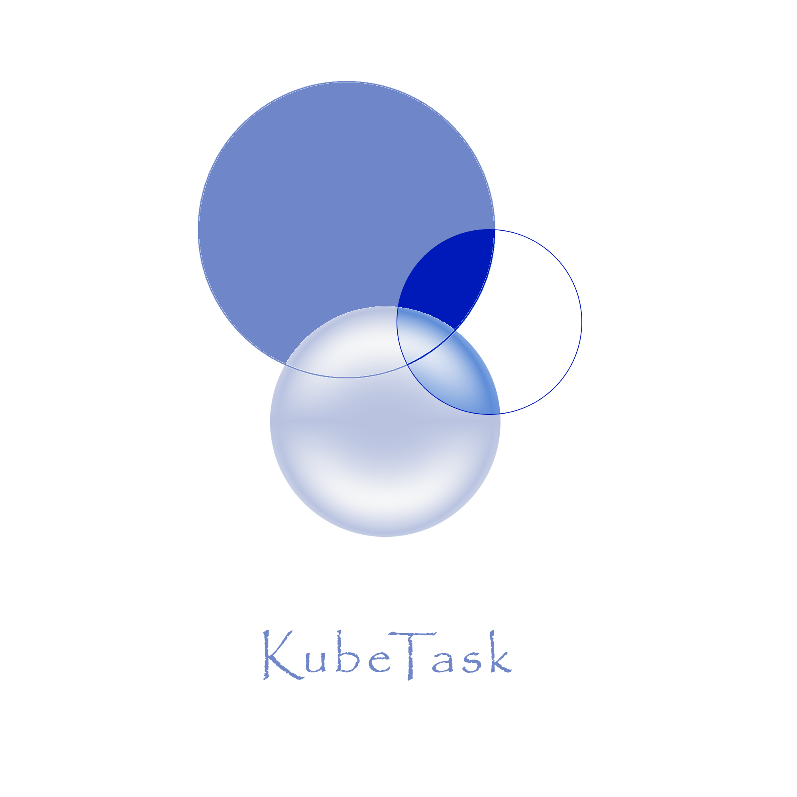
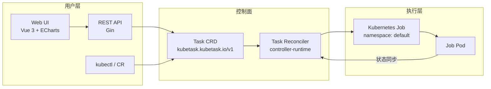

# KubeTask

智能云原生任务调度平台 —— 基于 Kubernetes Operator 模式的轻量级分布式任务调度系统。

KubeTask 用自定义资源（CRD）描述任务，由 Controller 自动将其转换为 Kubernetes Job 执行，并提供一个进程内运行的 Gin REST API 与 Vue 3 Web 管理界面。相比原生 CronJob，它提供统一的任务视图、任务状态机、执行历史、实时日志、统计趋势和可视化运维界面。

> 定位：轻量、可扩展、易部署，适用于中小团队、边缘计算（k3s）与云原生学习实践。

## 功能特性

- **Task CRD（Cluster 级）**：`kubetask.kubetask.io/v1`，支持三种任务类型
  - `Cron`：标准 5 字段 Cron 表达式定时调度（`robfig/cron`）
  - `OneTime`：创建后立即执行一次
  - `Delay`：创建后延迟指定时长再执行
- **Controller 自动编排**：Watch Task → 创建/更新/删除 Kubernetes Job，并同步 Job 状态到 Task 状态
  - 状态机：`Pending → Running → Succeeded / Failed / Suspended`
  - 执行历史保留最近 10 条，累计成功/失败次数
  - Finalizer + OwnerReference：删除 Task 时自动清理关联 Job
  - 失败自动重试（`backoffLimit`，默认 3）
  - 超时控制（`activeDeadlineSeconds`）与 Job 自动清理（`ttlSecondsAfterFinished`）
  - 并发策略：`Allow` / `Forbid` / `Replace`
  - 手动触发（trigger）、暂停（suspend）、恢复（resume）
- **REST API**：任务 CRUD、手动触发、暂停/恢复、统计、趋势、SSE 实时日志
- **Web UI**：Vue 3 + Vite + ECharts，提供仪表盘、任务列表、详情、创建/编辑、实时日志页面
- **SSE 流式日志**：通过 Kubernetes API 实时读取 Job Pod 日志，支持 `tail`、`sinceSeconds`、`follow`
- **配置管理**：Flag → YAML 配置文件 → 环境变量（Viper，`KUBETASK_` 前缀）
- **结构化日志**：Zap，支持 console / JSON 格式
- **可观测性**：controller-runtime Metrics、健康检查 `/healthz`、就绪检查 `/readyz`
- **Standalone 模式**：无 Kubernetes 集群时自动降级，仅提供 HTTP 服务并返回提示
- **一键部署**：多阶段 Dockerfile、Helm Chart、k3s 一键安装脚本

## 架构



Controller 与 HTTP Server 在同一进程中运行：`cmd/main.go` 启动 controller-runtime Manager，并在 goroutine 中启动 Gin 服务。

## 快速开始

### 环境要求

- Go 1.25+
- Docker
- kubectl + 一个 Kubernetes 集群（推荐 k3s；测试环境基于 envtest K8s v1.35.0）
- Helm 3（可选，用于 Chart 部署）

### 本地运行

确保 `~/.kube/config` 指向目标集群，然后直接运行：

```bash
go run ./cmd/main.go
```

或编译后运行：

```bash
go build -o bin/manager ./cmd/
./bin/manager
```

默认监听：

| 端口 | 用途 |
|------|------|
| `:8080` | REST API + Web UI（Gin） |
| `:8081` | 健康检查 `/healthz`、`/readyz` |
| `:8443` | Prometheus Metrics（默认 TLS 安全模式） |

> 如果没有找到 Kubernetes 集群，程序会进入 Standalone 模式：只启动 HTTP 服务，访问 API 会返回 503 提示。

### k3s 一键部署

```bash
bash deploy/k3s/install.sh
```

脚本会自动安装 k3s、构建镜像、导入镜像并 `helm upgrade --install` 部署 KubeTask，最后等待 Pod 就绪。

### Helm 部署

```bash
# 1. 构建镜像
docker build -t kubetask/controller:v0.1.0 .

# 2. 安装
helm install kubetask ./charts/kubetask \
  --set image.repository=kubetask/controller \
  --set image.tag=v0.1.0 \
  --set image.pullPolicy=Never

# 3. 访问
kubectl port-forward svc/kubetask 8080:8080
# 浏览器打开 http://localhost:8080
```

### 创建第一个任务

```bash
kubectl apply -f - <<'EOF'
apiVersion: kubetask.kubetask.io/v1
kind: Task
metadata:
  name: hello-kubetask
spec:
  type: OneTime
  image: busybox
  command: ["echo", "Hello from KubeTask!"]
EOF
```

查看任务状态与执行历史：

```bash
kubectl get task hello-kubetask -o yaml
```

### 启动 Web UI（开发模式）

```bash
cd web
npm install
npm run dev
```

Vite 开发服务器运行在 `http://localhost:5173`，会自动将 `/api` 代理到 `http://localhost:8080`。

## REST API

完整的请求参数、响应结构、错误码和 SSE 日志说明见 [API 文档](docs/API.md)。

| 方法 | 路径 | 说明 |
|------|------|------|
| `GET` | `/healthz` | 健康检查 |
| `POST` | `/api/v1/tasks` | 创建任务 |
| `GET` | `/api/v1/tasks?page=1&pageSize=20&type=Cron&phase=Running` | 任务列表（分页 + 类型/状态筛选） |
| `GET` | `/api/v1/tasks/:name` | 任务详情 |
| `PUT` | `/api/v1/tasks/:name` | 更新任务 |
| `DELETE` | `/api/v1/tasks/:name` | 删除任务 |
| `POST` | `/api/v1/tasks/:name/trigger` | 手动触发执行 |
| `POST` | `/api/v1/tasks/:name/suspend` | 暂停任务 |
| `POST` | `/api/v1/tasks/:name/resume` | 恢复任务 |
| `GET` | `/api/v1/tasks/:name/logs?tail=100&follow=true&sinceSeconds=60` | SSE 流式日志 |
| `GET` | `/api/v1/stats` | 任务统计（状态分布 + 类型分布） |
| `GET` | `/api/v1/stats/trend` | 按天执行趋势 |

示例：

```bash
# 创建 Cron 任务
curl -X POST http://localhost:8080/api/v1/tasks \
  -H 'Content-Type: application/json' \
  -d '{
    "metadata": {"name": "backup-db"},
    "spec": {
      "type": "Cron",
      "schedule": "0 2 * * *",
      "image": "postgres:15",
      "command": ["pg_dump", "mydb"]
    }
  }'

# 查看统计
curl http://localhost:8080/api/v1/stats

# 流式查看日志
curl -N 'http://localhost:8080/api/v1/tasks/hello-kubetask/logs?tail=100&follow=true'
```

## Task CRD 示例

### OneTime（一次性任务）

```yaml
apiVersion: kubetask.kubetask.io/v1
kind: Task
metadata:
  name: data-import
spec:
  type: OneTime
  image: alpine
  command: ["sh", "-c", "wget -qO- http://example.com/data | psql -U app"]
  backoffLimit: 3
  activeDeadlineSeconds: 3600
  ttlSecondsAfterFinished: 300
```

### Cron（定时任务）

```yaml
apiVersion: kubetask.kubetask.io/v1
kind: Task
metadata:
  name: nightly-backup
spec:
  type: Cron
  schedule: "0 2 * * *"          # 每天 02:00（标准 5 字段）
  image: postgres:15
  command: ["pg_dump", "-f", "/backup/db.sql"]
  concurrencyPolicy: Forbid      # Allow / Forbid / Replace
  env:
    - name: PGPASSWORD
      value: secret
  resources:
    requests:
      cpu: 100m
      memory: 128Mi
    limits:
      cpu: 500m
      memory: 512Mi
```

### Delay（延迟任务）

```yaml
apiVersion: kubetask.kubetask.io/v1
kind: Task
metadata:
  name: warmup-cache
spec:
  type: Delay
  delay: 30s                    # 格式："30s"、"5m"、"1h"
  image: busybox
  command: ["sh", "-c", "curl -s https://api.example.com/cache/warmup"]
```

## 配置

配置优先级：命令行 Flag > YAML 配置文件 > 环境变量（`KUBETASK_` 前缀）。

配置文件默认查找当前目录或 `./config` 下的 `kubetask.yaml`，也可以通过 `--config <path>` 指定：

```yaml
# kubetask.yaml
api-port: 8080
api-host: "0.0.0.0"
log-level: info          # debug / info / warn / error
log-format: console      # console / json
metrics-bind-address: ":8443"
metrics-secure: true
health-probe-bind-address: ":8081"
leader-elect: true
enable-http2: false
```

| 配置项 | 环境变量 | 默认值 | 说明 |
|--------|----------|--------|------|
| `api-host` | `KUBETASK_API_HOST` | `0.0.0.0` | HTTP 监听地址 |
| `api-port` | `KUBETASK_API_PORT` | `8080` | HTTP 端口 |
| `log-level` | `KUBETASK_LOG_LEVEL` | `info` | 日志级别 |
| `log-format` | `KUBETASK_LOG_FORMAT` | `console` | 日志格式 |
| `metrics-bind-address` | `KUBETASK_METRICS_BIND_ADDRESS` | `:8443` | Metrics 地址 |
| `metrics-secure` | `KUBETASK_METRICS_SECURE` | `true` | Metrics 是否启用 TLS |
| `health-probe-bind-address` | `KUBETASK_HEALTH_PROBE_BIND_ADDRESS` | `:8081` | 探针地址 |
| `leader-elect` | `KUBETASK_LEADER_ELECT` | `true` | 是否启用 Leader Election |
| `enable-http2` | `KUBETASK_ENABLE_HTTP2` | `false` | 是否启用 HTTP/2 |

> `database-*` 配置项已预留（PostgreSQL 持久化规划中），当前版本尚未使用。

## 项目结构

```
kubetask/
├── cmd/main.go                     # 程序入口（Controller + Gin HTTP 同进程）
├── api/v1/                         # Task CRD 类型定义
│   ├── task_types.go
│   ├── groupversion_info.go
│   └── zz_generated.deepcopy.go    # 自动生成，勿编辑
├── internal/
│   ├── config/                     # Viper 配置（Flag → YAML → EnvVar）
│   ├── logger/                     # Zap 结构化日志
│   ├── controller/                 # Task Reconciler + envtest 测试
│   ├── api/                        # Gin 路由 + Handler（CRUD / 日志 / 统计）
│   └── testutil/                   # Windows 下 envtest 进程清理
├── web/                            # Vue 3 + Vite + ECharts 前端
├── charts/kubetask/                # Helm Chart
├── deploy/k3s/                     # k3s 一键部署脚本
├── config/                         # Kustomize / CRD / RBAC 清单
├── test/e2e/                       # Kind 集群 E2E 测试
├── Makefile                        # 标准 Makefile（Windows 下不可用，见下）
└── Dockerfile
```

## 开发与测试

### Windows 注意事项

项目当前在 Windows 上开发，`make` 不可用，请直接调用 Go 工具链：

```bash
# 编译
go build ./...

# 静态检查
go vet ./...

# 重新生成 CRD / RBAC / DeepCopy（controller-gen，注意 Windows 下必须用完整 module 路径）
$gopath = $(go env GOPATH)
& "$gopath\bin\controller-gen" object rbac:roleName=manager-role crd `
  paths="kubetask.io/kubetask/api/v1/...;kubetask.io/kubetask/internal/controller/..." `
  output:crd:artifacts:config=config/crd/bases
```

### 运行测试

测试基于 envtest（etcd + kube-apiserver），需要先准备二进制并设置 `KUBEBUILDER_ASSETS`：

```bash
go install sigs.k8s.io/controller-runtime/tools/setup-envtest@release-0.23
& "$(go env GOPATH)\bin\setup-envtest" use 1.35.0 --bin-dir bin/k8s -p path

$env:KUBEBUILDER_ASSETS = "bin/k8s/k8s/1.35.0-windows-amd64"
go test ./... -count=1
```

`internal/testutil` 负责在 Windows 上正确清理 envtest 进程，避免 etcd / kube-apiserver 残留。

### 每次修改后的验证流程

```bash
go build ./...
go vet ./...
# 如修改了 CRD 类型，重新生成 controller-gen 产物
go test ./... -count=1
```

## Roadmap

| 版本 | 内容 | 状态 |
|------|------|------|
| **v0.1.0** | MVP：Task CRD + Controller + REST API + Web UI + Helm/k3s 部署 | ✅ 当前版本 |
| **v0.2.0** | DAG 工作流编排（Workflow CRD）、多租户认证、Webhook/钉钉/企微告警、调度增强 | 📋 规划中 |
| **v0.3.0** | 多集群管理（k3s + ACK 云边协同）、智能错峰调度、Prometheus + Grafana 可观测性 | 📋 规划中 |

详细设计见 [PROJECT_PLAN.md](PROJECT_PLAN.md)。

## License

Copyright 2026.

Licensed under the [Apache License, Version 2.0](http://www.apache.org/licenses/LICENSE-2.0).
