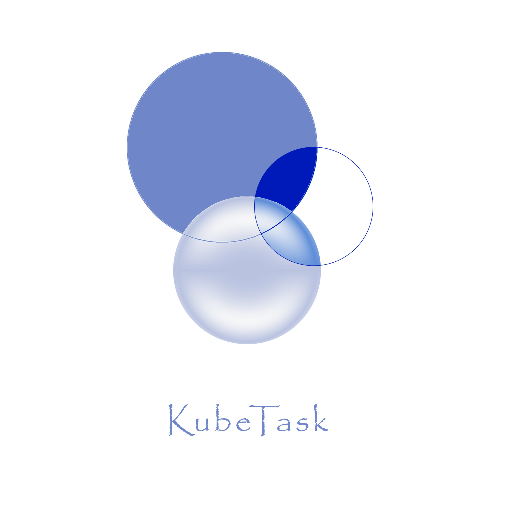
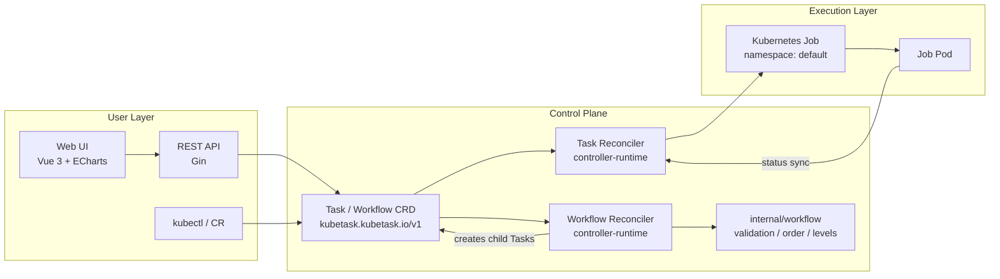

# KubeTask

Smart cloud-native task scheduling platform — a lightweight distributed task scheduling system built on the Kubernetes Operator pattern.

KubeTask describes tasks and workflows with custom resources (CRDs): a `Task` is turned into a Kubernetes Job by the controller, while a `Workflow` orchestrates multiple Tasks as a flat DAG. A Vue 3 web console and the in-process Gin REST API ship in the same process and are served on the same port. Compared with native CronJob, it provides a unified task view, task state machine, execution history, real-time logs, statistics/trends, and a visual operations UI.

> Positioning: lightweight, extensible, and easy to deploy — suitable for small/medium teams, edge computing (k3s), and cloud-native learning.

## Features

- **Task CRD (Cluster-scoped)**: `kubetask.kubetask.io/v1`, supports three task types
  - `Cron`: standard 5-field cron expressions (`robfig/cron`)
  - `OneTime`: executes immediately after creation
  - `Delay`: executes after a configurable delay
- **Controller orchestration**: watches Tasks → creates/updates/deletes Kubernetes Jobs, and syncs Job status back to Task status
  - State machine: `Pending → Running → Succeeded / Failed / Suspended`
  - Keeps the latest 10 execution records plus cumulative success/failure counters
  - Finalizer + OwnerReference: deleting a Task automatically cleans up its Jobs
  - Automatic retry on failure (`backoffLimit`, default 3)
  - Timeout control (`activeDeadlineSeconds`) and automatic Job cleanup (`ttlSecondsAfterFinished`)
  - Concurrency policies: `Allow` / `Forbid` / `Replace`
  - Manual trigger, suspend, and resume
- **Workflow CRD (DAG orchestration, cluster-scoped, short name `wf`)**: flat DAGs for multi-task dependencies
  - `spec.tasks[]` declares nodes and their `dependsOn` edges directly, with no entrypoint / templates indirection
  - Each node provides exactly one execution spec: a `template` referencing `spec.taskTemplates`, or an inline `taskSpec` (reusing `TaskSpec`, enforced by CEL)
  - `maxParallel` caps concurrently running nodes; `runOnFailure` marks failure-branch nodes
  - Phases: Workflow `Pending → Running → Succeeded / Failed`, node `Pending / Running / Succeeded / Failed / Skipped`
  - One Workflow CR represents one run; child Tasks are named `<workflow>-<node>` for deterministic, idempotent creation
- **DAG validation and topology library (`internal/workflow`)**: pure logic package with no Kubernetes client dependency, so the controller only orchestrates
  - Kahn topological sort, dependency cycle detection, and parallel level computation (`Levels()`)
  - Nine stable validation reasons (no tasks, duplicate name, self dependency, unknown dependency, duplicate dependency, missing template, and more) for `status.message` and Events
  - 19 unit tests covering validation rules, topological order, and level computation
- **REST API**: task CRUD, trigger, suspend/resume, stats, trends, and SSE streaming logs
- **Web UI (bundled with the image)**: Vue 3 + Vite + ECharts with dashboard, task list, detail, create/edit, and live log pages; the Dockerfile builds the frontend automatically, so no separate deployment is needed
- **SSE streaming logs**: reads Job Pod logs in real time through the Kubernetes API with `tail`, `sinceSeconds`, and `follow` support
- **Configuration**: Flags → YAML config file → environment variables (Viper, `KUBETASK_` prefix)
- **Structured logging**: Zap with console / JSON formats
- **Observability**: controller-runtime metrics, `/healthz` health check, `/readyz` readiness check
- **Standalone mode**: gracefully degrades when no Kubernetes cluster is available — HTTP only, with a hint returned for API routes
- **One-click deployment**: multi-stage Dockerfile, Helm chart, and a k3s install script

## Architecture


```mermaid
flowchart LR
    subgraph User Layer
        UI[Web UI<br/>Vue 3 + ECharts]
        API[REST API<br/>Gin]
        CLI[kubectl / CR]
    end

    subgraph Control Plane
        CRD[Task / Workflow CRD<br/>kubetask.kubetask.io/v1]
        CTRL[Task Reconciler<br/>controller-runtime]
        WCTRL[Workflow Reconciler<br/>controller-runtime]
        DAGPKG[internal/workflow<br/>validation / order / levels]
    end

    subgraph Execution Layer
        JOB[Kubernetes Job<br/>namespace: default]
        POD[Job Pod]
    end

    UI --> API
    API --> CRD
    CLI --> CRD
    CRD --> CTRL
    CTRL --> JOB
    JOB --> POD
    POD -- status sync --> CTRL
    CRD --> WCTRL
    WCTRL --> DAGPKG
    WCTRL -- creates child Tasks --> CRD
```

The controller and HTTP server run in the same process: `cmd/main.go` starts the controller-runtime Manager and launches the Gin server in a goroutine. Workflows are scheduled by `WorkflowReconciler`: it validates the DAG with `internal/workflow`, creates child Tasks according to dependencies and `maxParallel`, mirrors child Task state back into `status.nodes`, and handles failure branches through `runOnFailure` nodes.

## Quick Start

### Prerequisites

- Go 1.25+
- Docker
- kubectl and a Kubernetes cluster (k3s recommended; tests run against envtest K8s v1.35.0)
- Helm 3 (optional, for chart deployment)

### Run Locally

Make sure `~/.kube/config` points to your target cluster, then run:

```bash
go run ./cmd/main.go
```

Or build and run:

```bash
go build -o bin/manager ./cmd/
./bin/manager
```

Default listeners:

| Port | Purpose |
|------|---------|
| `:8080` | Web UI + REST API (Gin, same port) |
| `:8081` | Health `/healthz`, readiness `/readyz` |
| `:8443` | Prometheus metrics (TLS secure mode by default) |

> If no Kubernetes cluster is found, the process starts in standalone mode: only the HTTP server runs, and API routes return a 503 hint.
> The Web UI directory is configured with `web-dir` (default `/web/dist`, bundled inside the image). When running the binary locally, build the frontend first with `cd web && npm run build` and set `KUBETASK_WEB_DIR=web/dist` to access the UI and API on the same port 8080.

### One-Command k3s Deployment

```bash
bash deploy/k3s/install.sh
```

The script installs k3s, builds and imports the image, runs `helm upgrade --install`, and waits for the Pod to become ready.

### Helm Deployment

```bash
# 1. Build the image
docker build -t kubetask/controller:v0.1.0 .

# 2. Install
helm install kubetask ./charts/kubetask \
  --set image.repository=kubetask/controller \
  --set image.tag=v0.1.0 \
  --set image.pullPolicy=Never

# 3. Access the Web UI and API (same port)
kubectl port-forward svc/kubetask 8080:8080
# Open http://localhost:8080 in your browser
```
### Verify the Deployment

```bash
curl -s http://localhost:8080/healthz          # {"status":"ok"}
curl -s http://localhost:8080/api/v1/stats     # JSON stats
curl -s http://localhost:8080/ | head          # SPA index.html
```


### Create Your First Task

```bash
kubectl apply -f - <<'EOF'
apiVersion: kubetask.kubetask.io/v1
kind: Task
metadata:
  name: hello-kubetask
spec:
  type: OneTime
  image: busybox
  command: ["echo", "Hello from KubeTask!"]
EOF
```

Inspect task status and execution history:

```bash
kubectl get task hello-kubetask -o yaml
```

### Run the Web UI in Development Mode

The frontend source lives in `web/`. Production deployment does not need a separate frontend (the image build produces the static assets automatically); start Vite only when you want to work on the UI:

```bash
cd web
npm install
npm run dev
```

The Vite dev server runs at `http://localhost:5173` and proxies `/api` to `http://localhost:8080`.
## REST API

Full request parameters, response shapes, error codes, and SSE log details live in the [API reference](docs/API.md).

> The Workflow HTTP API (`/api/v1/workflows`) is not implemented yet. Define Workflows through `kubectl` or YAML for now; `kubectl get wf` lists them.

| Method | Path | Description |
|--------|------|-------------|
| `GET` | `/healthz` | Health check |
| `POST` | `/api/v1/tasks` | Create a task |
| `GET` | `/api/v1/tasks?page=1&pageSize=20&type=Cron&phase=Running` | List tasks (pagination + type/phase filters) |
| `GET` | `/api/v1/tasks/:name` | Get a task |
| `PUT` | `/api/v1/tasks/:name` | Update a task |
| `DELETE` | `/api/v1/tasks/:name` | Delete a task |
| `POST` | `/api/v1/tasks/:name/trigger` | Manually trigger execution |
| `POST` | `/api/v1/tasks/:name/suspend` | Suspend a task |
| `POST` | `/api/v1/tasks/:name/resume` | Resume a task |
| `GET` | `/api/v1/tasks/:name/logs?tail=100&follow=true&sinceSeconds=60` | SSE streaming logs |
| `GET` | `/api/v1/stats` | Task stats (status + type distribution) |
| `GET` | `/api/v1/stats/trend` | Daily execution trend |

Examples:

```bash
# Create a Cron task
curl -X POST http://localhost:8080/api/v1/tasks \
  -H 'Content-Type: application/json' \
  -d '{
    "metadata": {"name": "backup-db"},
    "spec": {
      "type": "Cron",
      "schedule": "0 2 * * *",
      "image": "postgres:15",
      "command": ["pg_dump", "mydb"]
    }
  }'

# Get stats
curl http://localhost:8080/api/v1/stats

# Stream logs
curl -N 'http://localhost:8080/api/v1/tasks/hello-kubetask/logs?tail=100&follow=true'
```

## Task CRD Examples

### OneTime

```yaml
apiVersion: kubetask.kubetask.io/v1
kind: Task
metadata:
  name: data-import
spec:
  type: OneTime
  image: alpine
  command: ["sh", "-c", "wget -qO- http://example.com/data | psql -U app"]
  backoffLimit: 3
  activeDeadlineSeconds: 3600
  ttlSecondsAfterFinished: 300
```

### Cron

```yaml
apiVersion: kubetask.kubetask.io/v1
kind: Task
metadata:
  name: nightly-backup
spec:
  type: Cron
  schedule: "0 2 * * *"          # every day at 02:00 (standard 5 fields)
  image: postgres:15
  command: ["pg_dump", "-f", "/backup/db.sql"]
  concurrencyPolicy: Forbid      # Allow / Forbid / Replace
  env:
    - name: PGPASSWORD
      value: secret
  resources:
    requests:
      cpu: 100m
      memory: 128Mi
    limits:
      cpu: 500m
      memory: 512Mi
```

### Delay

```yaml
apiVersion: kubetask.kubetask.io/v1
kind: Task
metadata:
  name: warmup-cache
spec:
  type: Delay
  delay: 30s                    # format: "30s", "5m", "1h"
  image: busybox
  command: ["sh", "-c", "curl -s https://api.example.com/cache/warmup"]
```

## Workflow CRD Example (DAG)

One Workflow CR is one DAG run: a node runs after every `dependsOn` dependency succeeds, while a `runOnFailure: true` node waits for all dependencies to reach a terminal phase and runs when at least one of them is `Failed / Skipped` (if all succeed, the node is marked `Skipped`). In the sample below `build → test` runs in sequence and `notify-failure` is the failure branch.

```yaml
apiVersion: kubetask.kubetask.io/v1
kind: Workflow
metadata:
  name: workflow-sample
spec:
  maxParallel: 2                # concurrent node limit, 0 means unlimited
  tasks:
    - name: build
      template: go-build
    - name: test
      dependsOn: [build]
      template: go-test
    - name: notify-failure
      dependsOn: [test]
      runOnFailure: true        # runs only when dependencies fail
      template: notify
  taskTemplates:                # named templates, reusable by multiple nodes
    go-build:
      type: OneTime             # Workflow nodes must be OneTime
      image: golang:1.25
      command: ["go", "build", "./..."]
      backoffLimit: 3
    go-test:
      type: OneTime
      image: golang:1.25
      command: ["go", "test", "./..."]
    notify:
      type: OneTime
      image: curlimages/curl
      command: ["sh", "-c", "echo workflow failed"]
```

Nodes can also inline their execution spec instead of referencing a template:

```yaml
    - name: inline-node
      taskSpec:
        type: OneTime
        image: busybox
        command: ["echo", "inline task"]
```

Other constraints: a node must set exactly one of `template` or `taskSpec`; node names must match `^[a-z0-9]([-a-z0-9]*[a-z0-9])?$`; at most 50 nodes; dependency cycles are rejected by `internal/workflow` at runtime.

## Configuration

Priority: command-line flags > YAML config file > environment variables (`KUBETASK_` prefix).

The config file is looked up as `kubetask.yaml` in the current directory or `./config`, and can be overridden with `--config <path>`:

```yaml
# kubetask.yaml
api-port: 8080
api-host: "0.0.0.0"
log-level: info          # debug / info / warn / error
log-format: console      # console / json
metrics-bind-address: ":8443"
metrics-secure: true
health-probe-bind-address: ":8081"
leader-elect: true
enable-http2: false
web-dir: /web/dist      # Web UI static directory (default inside the image)
```

| Key | Env var | Default | Description |
|-----|---------|---------|-------------|
| `api-host` | `KUBETASK_API_HOST` | `0.0.0.0` | HTTP listen address |
| `api-port` | `KUBETASK_API_PORT` | `8080` | HTTP port |
| `web-dir` | `KUBETASK_WEB_DIR` | `/web/dist` | Web UI static directory; when missing, only the UI is disabled and the API keeps running |
| `log-level` | `KUBETASK_LOG_LEVEL` | `info` | Log level |
| `log-format` | `KUBETASK_LOG_FORMAT` | `console` | Log format |
| `metrics-bind-address` | `KUBETASK_METRICS_BIND_ADDRESS` | `:8443` | Metrics address |
| `metrics-secure` | `KUBETASK_METRICS_SECURE` | `true` | Enable TLS for metrics |
| `health-probe-bind-address` | `KUBETASK_HEALTH_PROBE_BIND_ADDRESS` | `:8081` | Probe address |
| `leader-elect` | `KUBETASK_LEADER_ELECT` | `true` | Enable leader election |
| `enable-http2` | `KUBETASK_ENABLE_HTTP2` | `false` | Enable HTTP/2 |

> The `database-*` keys are reserved (planned PostgreSQL persistence) and are not used by the current version.

## Project Structure

```
kubetask/
├── cmd/main.go                     # Entry point (Controller + Gin HTTP in one process)
├── api/v1/                         # Task / Workflow CRD types
│   ├── task_types.go
│   ├── workflow_types.go           # Flat DAG spec and CEL validation rules
│   ├── groupversion_info.go
│   └── zz_generated.deepcopy.go    # auto-generated, do not edit
├── internal/
│   ├── config/                     # Viper config (Flag → YAML → EnvVar)
│   ├── logger/                     # Zap structured logging
│   ├── controller/                 # Task / Workflow Reconciler + envtest suites
│   ├── workflow/                   # DAG validation / topological order / levels (pure logic + unit tests)
│   ├── api/                        # Gin router + handlers (CRUD / logs / stats) and Web UI static serving
│   └── testutil/                   # envtest process cleanup on Windows
├── docs/API.md                     # HTTP API reference
├── web/                            # Vue 3 + Vite + ECharts frontend
├── charts/kubetask/                # Helm chart
├── deploy/k3s/                     # k3s one-click install script
├── config/                         # Kustomize / CRD / RBAC manifests
├── test/e2e/                       # Kind cluster E2E tests
├── Makefile                        # Standard Makefile (unavailable on Windows, see below)
└── Dockerfile
```

## Development & Testing

### Windows Notes

The project is developed on Windows, where `make` is unavailable — call the Go toolchain directly:

```bash
# Build
go build ./...

# Static analysis
go vet ./...

# Regenerate CRD / RBAC / DeepCopy (controller-gen; on Windows use the full module paths)
$gopath = $(go env GOPATH)
& "$gopath\bin\controller-gen" object rbac:roleName=manager-role crd `
  paths="kubetask.io/kubetask/api/v1/...;kubetask.io/kubetask/internal/controller/..." `
  output:crd:artifacts:config=config/crd/bases
```

### Running Tests

Tests use envtest (etcd + kube-apiserver). Prepare the binaries and set `KUBEBUILDER_ASSETS` first:

```bash
go install sigs.k8s.io/controller-runtime/tools/setup-envtest@release-0.23
& "$(go env GOPATH)\bin\setup-envtest" use 1.35.0 --bin-dir bin/k8s -p path

$env:KUBEBUILDER_ASSETS = "bin/k8s/k8s/1.35.0-windows-amd64"
go test ./... -count=1
```

`internal/testutil` properly cleans up envtest processes on Windows to avoid leaking etcd / kube-apiserver.

### Verification Pipeline After Every Edit

```bash
go build ./...
go vet ./...
# Regenerate controller-gen output if CRD types changed
go test ./... -count=1
```

## Roadmap

| Version | Content | Status |
|---------|---------|--------|
| **v0.1.0** | MVP: Task CRD + Controller + REST API + Web UI (same-port bundle) + Helm/k3s deployment | ✅ Done |
| **v0.2.0** | DAG workflows (Workflow CRD) | 🚧 In progress |
| ↳ | Workflow CRD types, CEL validation, CRD / RBAC / sample generation | ✅ Done |
| ↳ | `internal/workflow` DAG validation and topology library (19 unit tests) | ✅ Done |
| ↳ | Workflow Reconciler: child Task orchestration, status write-back, failure propagation, `maxParallel` throttling, deletion cleanup (32 envtest specs + 7 unit tests) | ✅ Done |
| ↳ | Workflow HTTP API and frontend DAG view | 📋 Planned |
| ↳ | Multi-tenancy auth, Webhook/DingTalk/WeCom alerts, scheduling enhancements | 📋 Planned |
| **v0.3.0** | Multi-cluster management (k3s + ACK cloud-edge), smart off-peak scheduling, Prometheus + Grafana observability | 📋 Planned |

See [PROJECT_PLAN.md](PROJECT_PLAN.md) for the detailed design.

## License

Copyright 2026.

Licensed under the [Apache License, Version 2.0](http://www.apache.org/licenses/LICENSE-2.0).
